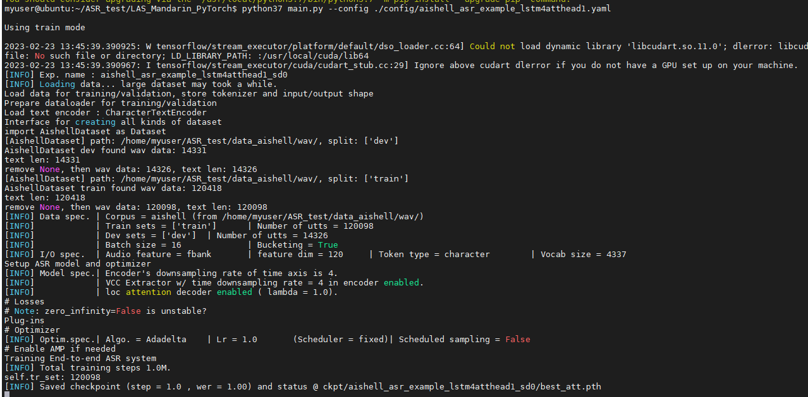
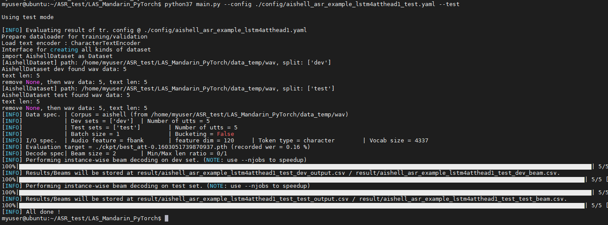
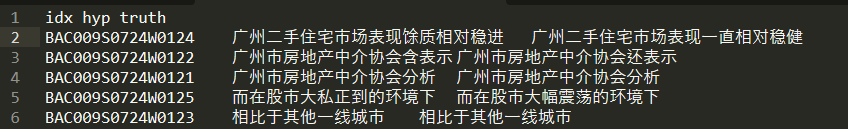
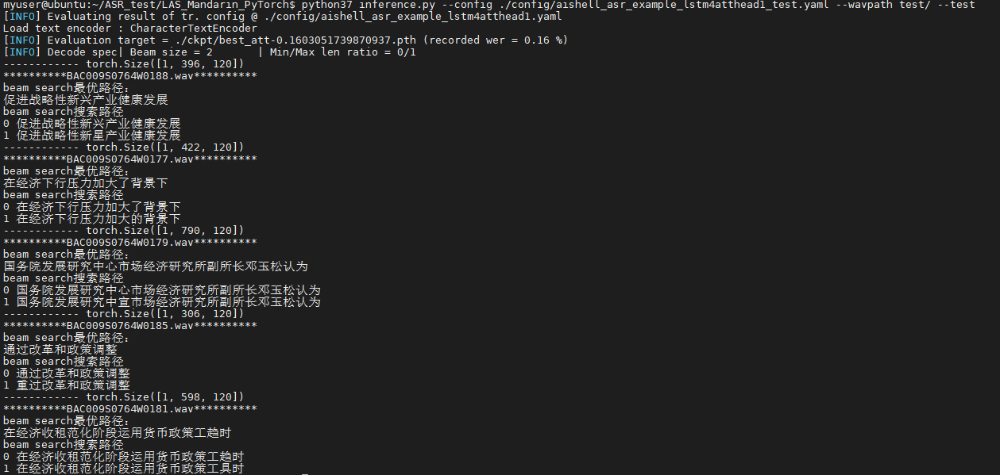

## LAS(普通话语音识别的训练与测试）


### **Listen-Attend-Spell**


LAS由3部分构成，Encoder, attention, Decoder.详细说明参考：https://dataxujing.github.io/ASR-paper/#/zh-cn/05_LAS

**安装依赖**

```bash
pip install -r requirements.txt
```


**数据集的构建**

这里我们使用[aishell](https://openslr.org/33/)中文普通话数据集训练模型，该数据集结构如下：

```shell
data_aishell
├── transcript # 存放标注文本：aishell_transcript_v0.8.txt
└── wav        # 存放.wav的文件
    ├── dev
    ├── test
    └── train
```

**数据预处理**

基于语音标注数据生成词典，可以指定以字符，以词,或者子词为单位。 基于数据集的 transcripts 文件生成vocab 文件. 请参考 代码 [generate_vocab_file.py](generate_vocab_file.py). 如果你想训练 aishell 数据集, 你可以直接使用我写好的 [generate_vocab_file_aishell.py](generate_vocab_file_aishell.py).

```shell
python generate_vocab_file_aishell.py --input_file /home/myuser/ASR_test/data_aishell/transcript/aishell_transcript_v0.8.txt --output_file ./aishell_vocab.txt --mode character --vocab_size 5000
```

将创建好一个 vocab 文件， 在目录下命名为 `aishell_vocab.txt`.


**模型训练**

LAS的声学模型和语言模型（可以没有）独立训练，声学模型的训练基于语音标注数据，语言模型的训练基于标注的文本以自回归的方式训练语言模型。

+ 声学模型的训练

在训练之前, 需要重写自己的dataset加载器的代码 in package [dataset](dataset). 如果想使用我写好的aishell dataset 的加载器代码, 需要注意数据集里的 transcripts file 的路径配置，见 [dataset/aishell.py](dataset/aishell.py) 的第26行:

```shell
src_file = "/home/myuser/ASR_test/data_aishell/" + "transcript/aishell_transcript_v0.8.txt"
```

当一切都准备好. 就可以开始训练了:

```shell
python main.py --config ./config/aishell_asr_example_lstm4atthead1.yaml
```

你可以自定义自己的配置文件, 可以参考 [config/aishell_asr_example_lstm4atthead1.yaml](config/aishell_asr_example_lstm4atthead1.yaml) . 特别注意的变量: corpus's path & vocab_file



数据集的构建和加载是比较漫长的，请内心等待。当你看到这个界面时，表示已经开始进行训练。

+ 语言模型的训练

```shell
python3 main.py --config config/lm_example.yaml --lm
```

需要自己构建语言模型的配置文件`lm_example.yaml`，配置文件需要的key可以参考：`core/lm.py`中的`__init__`方法：

```python
class RNNLM(nn.Module):
    ''' RNN Language Model '''

    def __init__(self, vocab_size, emb_tying, emb_dim, module, dim, n_layers, dropout):
        super().__init__()
        self.dim = dim
        self.n_layers = n_layers
        self.emb_tying = emb_tying
        if emb_tying:
            assert emb_dim == dim, "Output dim of RNN should be identical to embedding if using weight tying."
        self.vocab_size = vocab_size
        self.emb = nn.Embedding(vocab_size, emb_dim)
        self.dp1 = nn.Dropout(dropout)
        self.dp2 = nn.Dropout(dropout)
        self.rnn = getattr(nn, module.upper())(
            emb_dim, dim, num_layers=n_layers, dropout=dropout, batch_first=True)
        if not self.emb_tying:
            self.trans = nn.Linear(emb_dim, vocab_size)
```

经验表明增加语言模型，可以提高ASR的准确率。

**模型验证**

```shell
python main.py --config ./config/aishell_asr_example_lstm4atthead1_test.yaml --test 
```





**模型推断**

```
python inference.py --config ./config/aishell_asr_example_lstm4atthead1_test.yaml --wavpath test/ --test
```



识别结果Demo展示：

<audio id="audio" controls="" preload="none"><br/>      <source id="mp3" src="docs/test/BAC009S0764W0177.wav"><br/></audio>

识别结果：

```
**********BAC009S0764W0177.wav**********
beam search最优路径：
在经济下行压力加大了背景下
beam search搜索路径
0 在经济下行压力加大了背景下
1 在经济下行压力加大的背景下
```

<audio id="audio" controls="" preload="none"><br/>      <source id="mp3" src="docs/test/BAC009S0764W0188.wav"><br/></audio>

```
**********BAC009S0764W0188.wav**********
beam search最优路径：
促进战略性新兴产业健康发展
beam search搜索路径
0 促进战略性新兴产业健康发展
1 促进战略性新星产业健康发展
```


>  LAS的缺点： 其实其精度可能并不比传统的GMM-HMM模型高，并且LAS不能做流式的ASR。


## **Reference**

1. [**Listen, Attend and Spell**](https://arxiv.org/abs/1508.01211v2), W Chan et al.
2. [Neural Machine Translation of Rare Words with Subword Units](http://www.aclweb.org/anthology/P16-1162), R Sennrich et al.
3. [Attention-Based Models for Speech Recognition](https://arxiv.org/abs/1506.07503), J Chorowski et al.
4. [Connectionist Temporal Classification: Labelling Unsegmented Sequence Data with Recurrent Neural Networks](https://www.cs.toronto.edu/~graves/icml_2006.pdf), A Graves et al.
5. [Joint CTC-Attention based End-to-End Speech Recognition using Multi-task Learning](https://arxiv.org/abs/1609.06773), S Kim et al.
6. [Advances in Joint CTC-Attention based End-to-End Speech Recognition with a Deep CNN Encoder and RNN-LM](https://arxiv.org/abs/1706.02737), T Hori et al.
7. https://github.com/jackaduma/LAS_Mandarin_PyTorch

<!--  -->


